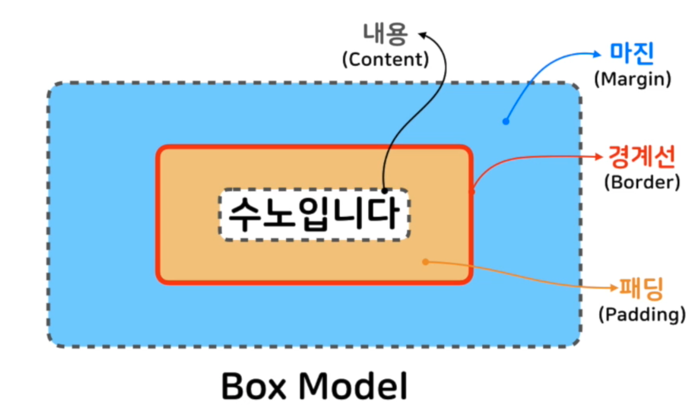

### CSS #2
#### 박스 모델 개념
</img>

- Content(내용)
    * overflow : hidden, scroll
- Border(경계선) : Content를 감싸는 테두리 선
    - border-style : dashed solid dotted double; # 상 우 좌 하
    - border-width : 8px 4px 5px 6px
    - border-color : red blue yellow black
    - **border** : 4px solid lemonchiffon;
    - border-radius : 12px -> 반지름의 길이
        - border-top-left-radius
        - border-top-right-radius
        - border-bottom-left-radius
        - border-bottom-right-raidus
            - 30px 10px -> 타원형
- Padding(패딩) : Content와 Border사이의 여백
    - padding : 20px;
- Margin(마진) : Border밖의 여백
    - margin : 20px;
    - 마진 상쇄(Margin Collapse) : 더 큰 마진만 적용

* Box-sizing : content-box;
    - width(height) = content size
* box-sizing : border-box;
    - width(height) = content size + padding + border

#### 위치와 관련된 프로퍼티
- display : 요소가 보여지는 방식을 지정
    - default : block, inline
        - block : 새로운 줄에서 시작되고 width : 100%
            - width, height, margin, padding 가능
        * inline : 기존 줄에서 시작되고 content크기의 width를 가진다. 
            - width,height,margin-top,margin-bottom 불가능
            - 불편함
        * inline-block :
             - width,height,margin-top,margin-bottom 불가능
        -  none : 브라우저에 해당 요소 출력 X
- position : 요소의 위치를 정의
    - static(기본값) : 기본값, 좌표 프로퍼티를 쓸 수 없음
    - relative : 기본 위치를 기준으로 좌표를 사용함
    - absolute : 부모나 조상 중 relative,absolute,fixed가 선언된 곳을 기준으로 좌표 프로퍼티 적용
    - fixed : fixed는 보이는 화면을 기준으로 좌표 프로퍼티를 이용하여 위치를 조정
- Z-index : 요소의 위 아래로 겹치는 우선순위