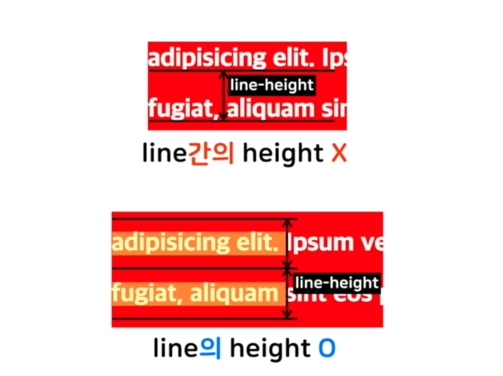

### CSS #1

#### CSS(Cascading Style Sheet)
- Styel Sheets
- 선택자(Selector) : 스타일을 적용하고자 하는 HTML 요소를 선택하는 역할
- 속성(Property) : 지정할 스타일의 속성명에 해당
    - 속성 : 값;이 한 단위
    - ;(세미 클론)을 이용하여 구분
- 값(Value) : 키워드나 특정 단위를 이용하여 원하는 스타일을 적용
    - 속성(Property)과 쌍을 이룸

```
이 문단에는 폰트는 맑은 고딕, 크기는 18px, 색은 파랑으로 해주세요

p{
    font-family : '맑은 고딕';
    font-size : 18px;
    color : blue; - 선언(Declaration)
} - 선언 블럭(Declaration Block)
```

#### HTML에 CSS를 적용하는 방법
**Selector**
- 스타일을 적용하고자 하는 HTML 요소를 선택하는 역할
- 여러개의 선택자를 ,를 이용하여 스타일을 한번에 지정 가능

1. Link Style
    - HTML밖에 있는 CSS파일 적용
    - <pre><code><link rel="stylesheet" href="파일명.css"></code></pre>

2. Embedding Style
    - HTML의``` <head>```에 ```<style>```를 이용하여 CSS를 작성
    - ```<style> ... CSS파일 내용 ... </style>```

3. Inline Style
    - HTML요소에 직접 style 속성(Attributes)을 이용하여 CSS를 작성
    - <pre><code><h1 style="color : red;">제목</h1></code></pre>
    
#### 단순 선택자
- 타입 선택자 (Type Selector) :
    - 해당 태그를 가지는 모든 요소에 스타일을 적용
- 아이디 선택자 (ID Selector) :
    - 아이디(ID) : HTML 문서 내에서 동일한 아이디는 존재할 수 없음 다른 요소와 구분되는 점을 만들어줌
    - #ID
- 클래스 선택자 (Class Selector) :
    - 클래스(Class) : 비슷한 특징을 갖는 요소를 지정하여 묶을 수 있음, 여러 번 사용이 가능
    - .Class
- 전체 선택자 : *
- 속성 선택자(Attributes Selector) : 
    - 특정 속성을 소유하는 모든 요소에 스타일을 적용
    - 태그[속성명='속성값] , a[target="_blank"]{css코드}
    - 태그 대신 다른 선택자들도 가능
- 복합 선택자 () :
    - 자식 선택자 (Child Selector) : 선택자 A의 모든 자식 중 선택자B와 일치하는 요소 선택
        - 선택자A > 선택자B {css코드}
    - 후손 선택자 (Descendant Selector) : 선택자A의 모든 후손 중 선택자B와 일치하는 요소 선택
        - 선택자A 선택자B {css코드}

#### Pseudo 클래스
- 요소의 특별한 상태를 지정할 때 씀 : :active, :link, :visited, :hover
- 선택자: pseudo-class(가상클래스){속성:속성값;}
    - :link : 방문하지 않은 링크일 경우
    - :visited : 방문한 링크일 경우
    - :hover : 요소에 마우스가 올라와 있을 경우

#### 값(Value), 단위와 색
- 각 프로퍼티에 사용할 수 있는 값 : 숫자 값, 키워드, 색
    - 숫자 값 : 단위(px,em,rem)
        - px : 화소 단위 -> 절대 길이
            - 1px = 1/96 in
        - em : 상대적 길이 - 현재 스타일이 지정된 요소의 Font-Size기준
        - rem : 상대적 길이 - 최상위 요소의 Font-Size 기준
            - 1em(rem) = 기준 Font-size * 1em(rem)
            - 반응형 웹 사이즈 조절
            - rem을 권장
        - % : 상대 길이, 보통 이미지나 레이아웃의 너비나 높이를 지정할 때 씀
    - 색 : 키워드, hex code, rgb, hsl
        - hex code = #000000, black
            - #000000 00~ff : 투명도
        - rgb = rgb(0,0,0), black
            - rgba(0,0,0,(0~1사이의 값)) : 투명도

#### 텍스트와 관련된 프로퍼티
- 폰트와 관련된 프로퍼티 :
    - font-size
        - 기본 font-size : 16px
    - font-family : (폰트 명) - 'Cute Font',Arial, cursive(일반글꼴);
        - 여러개의 폰트를 적용시켜 마지막에는 기본 os에서 사용하는 일반 글꼴을 추가하여 텍스트에 문제가 없도록 한다.
        - 일반 폰트 : serif,sans-serif,cursive,fantasy,monospace
        - 경로를 통해 저장된 폰트를 사용할 수 있다.
        - 웹 폰트 : Google Fonts
            - Standard : link 태그를 통한 적용
    - font-style : italic, normal, oblique(italic체의 기본 값)
    - font-weight : Bold,100,200,...,900
        - 400 : normal
        - 700 : bold

- font : font-style, font-weight, font-size, font-family

#### 텍스트 정렬과 관련된 속성 
    - text-align : 자신을 기준으로 텍스트를 좌,우,중앙 정렬함
        - left,right,center
    - line-height : 문장 사이의 간격을 조정함 (line간의 height가 아닌 line의 height를 뜻한다.)
        - 단위 없는 경우 : Font-size를 기준으로 배수 조정
        - 단위가 있는 경우 : 해당 단위의 간격으로 조정
    - letter-spacing : 글자와 글자 사이의 간격을 조정함, 자간
        - 단위 사용
    - text-indent : 문단의 시작부에 들여쓰기를 함

</img>